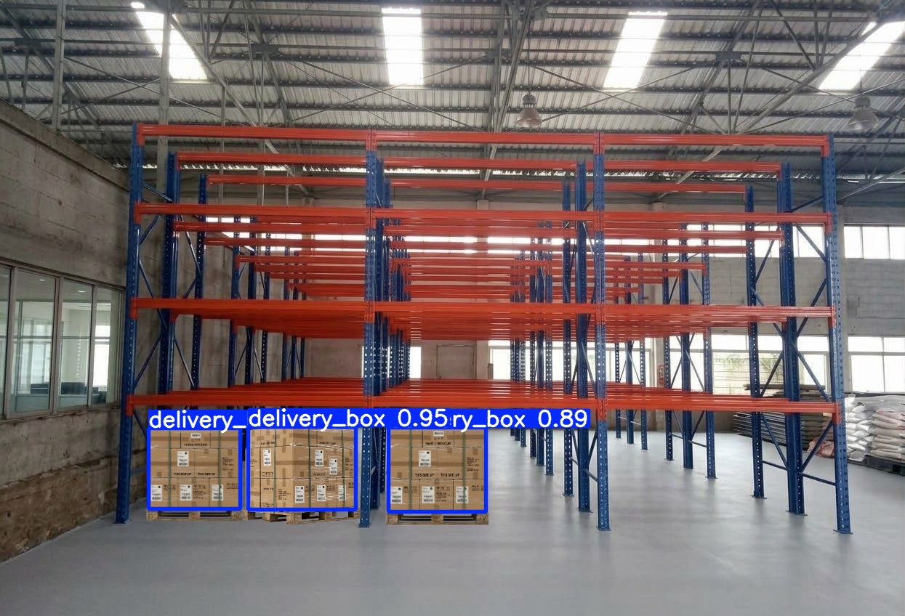

# stock forecasting

ระบบจัดการและวิเคราะห์ข้อมูลสต็อกอาหารทะเล ประกอบด้วย React frontend, FastAPI backend, งานเบื้องหลังผ่าน ARQ/Redis, PostgreSQL, MinIO และชุดเครื่องมือ observability ที่ประกาศไว้ใน Docker Compose

เอกสารนี้สรุปจาก source, configuration และไฟล์ข้อมูลที่อยู่ใน repository ปัจจุบัน โฟลเดอร์ย่อยมี README อธิบายไฟล์ในขอบเขตของตนเอง

## ส่วนประกอบ

- `frontend/`: React + TypeScript + Vite มีหน้า Dashboard และ Training Studio ใช้ `/api` เป็น base URL
- `backend/src/`: FastAPI ลงทะเบียน API สำหรับ stock, forecast, camera, sampling, settings, risk และ Hugging Face
- `workers/`: ARQ worker สำหรับ forecast, model training และ camera sampling รวมถึงสคริปต์ seed ข้อมูล
- `storage/`: CSV สต็อกรายวัน/รายเดือน, YOLO dataset configuration และ ARIMA model artifacts ที่ติดตามใน Git
- `scripts/`: เครื่องมือเรียกใช้ด้วยตนเอง เช่น backup, import/export, model/dataset sync และ smoke test
- `observability/`: configuration และ Grafana provisioning สำหรับ Prometheus, Loki, Tempo และ OpenTelemetry Collector
- `backend/alembic/`: migration history; backend ยังสร้างตารางจาก SQLAlchemy metadata ตอนเริ่มต้นด้วย
- `docs/`: คู่มือและรายงานเอกสาร; ให้ตรวจคู่มือ API กับ schema/source ปัจจุบันก่อนใช้งาน
- `sandbox/`: scripts และ tests ทดลองซึ่งอาจอ้างถึง API/model รุ่นก่อน ไม่ใช่ test suite หลัก
- `backups/`: พื้นที่ local สำหรับ backup; archive ไม่ควร commit หรือแชร์โดยไม่ตรวจข้อมูลภายใน

## เส้นทางการทำงานที่มีในโค้ด

1. Frontend เรียก stock/settings/forecast/risk/camera/Hugging Face API ผ่าน `/api` (Vite proxy ใน development หรือ Nginx ใน production)
2. `POST /api/forecast` ส่งงาน `run_forecast_task` ไป `forecasting_queue`; worker พยายามทำ camera sampling ก่อน แล้วจึงประมวลผล ARIMA ต่อ แม้ sampling ล้มเหลวก็ส่ง error ของ sampling กลับไปกับผล forecast
3. `POST /api/sampling/capture` ส่ง `run_sampling_task` ไป `sampling_queue`; sampling worker อ่านวิดีโอ mock, ใช้ YOLO, อัปโหลดภาพไป MinIO และบันทึกผลลง PostgreSQL เมื่อมี dependency และ model พร้อม
4. `POST /api/forecast/train` และ `/api/forecast/train/yolo` ส่งงานไป `training_queue` สำหรับ trainer ที่ตรงชนิดโมเดล
5. Forecast service ใช้ `monthly_inventories` และ `box_logs` จาก PostgreSQL; มี CSV fallback สำหรับข้อมูล inventory เมื่อ query ไม่มีข้อมูลในกรณีที่ service รองรับ

API routes ที่มีในปัจจุบัน:

- `/api/stock`: upload CSV, list, summary, products และ history
- `/api/forecast`: enqueue forecast/training, อ่าน forecast ล่าสุด และตรวจ job status
- `/api/camera`: sampled frame, frame inference, latest metadata และ camera logs
- `/api/sampling`: capture, status และ box logs
- `/api/settings`, `/api/risk/evaluate`, `/api/hf`: settings, คำนวณความเสี่ยง และจัดการโมเดล Hugging Face
- `/health/live`, `/health/ready`, `/health`: probes และสถานะ PostgreSQL, Redis, MinIO

FastAPI เปิด Swagger UI ที่ `/` และ ReDoc ที่ `/redoc` ตามค่า `docs_url`/`redoc_url` ใน `backend/src/main.py`.

## การตั้งค่าและ Compose

ไฟล์ `compose.yml` ประกาศ PostgreSQL, Redis, MinIO, backend, workers, MLflow, TensorBoard, Label Studio, Grafana และบริการ telemetry รวมถึง frontend; `compose.override.yml` ปรับการทำงานเป็น Vite development server ส่วน `compose.prod.yml` ปรับ frontend/backend/workers สำหรับ production และปิดการ publish พอร์ตภายในส่วนใหญ่

ตัวอย่างการเตรียม environment (คัดลอกเฉพาะเมื่อยังไม่มีไฟล์ เพื่อไม่เขียนทับค่าที่ตั้งไว้แล้ว):

```powershell
if (-not (Test-Path .env)) { Copy-Item .env.example .env }
```

คำสั่ง Compose ที่กำหนดไว้สำหรับ development:

```text
docker compose up --build
```

สำหรับ production มี environment template `.env.production.example`; สร้าง `.env.production` จาก template แล้วกำหนดค่าจริงก่อนใช้คำสั่งใน `compose.prod.yml`:

```powershell
if (-not (Test-Path .env.production)) { Copy-Item .env.production.example .env.production }
```

```text
docker compose -f compose.yml -f compose.prod.yml --env-file .env.production up --build -d
```

โปรดตรวจสอบค่าใน environment example และเปลี่ยน credentials ให้เหมาะกับ environment ก่อน deploy ห้ามนำ secret จริงเข้า Git

### ข้อกำหนดที่ยังไม่ครบใน checkout นี้

- `inventory-seed` เรียก `workers/inventory_data.py` ซึ่งค้นหา `INVENTORY_CSV_PATH` หรือไฟล์ `storage/data/csvfile/inventory/inventory_summary.csv` และ fallback ไป `storage/data/csv_file/inventory_summary (1).csv`; ไม่มี path เหล่านี้ในไฟล์ที่ติดตามอยู่ในปัจจุบัน แม้จะมี CSV รายวัน/รายเดือนคนละชื่อใน `storage/data/csv_file/` ก็ตาม Backend, forecasting-worker และ training-worker ระบุ dependency ให้รอ seed สำเร็จ จึงต้องจัดเตรียม CSV ที่ตรง schema/path ก่อนใช้งาน Compose flow นี้
- Compose ประกาศ `data-worker` และ `workers/Dockerfile.data` สั่งคัดลอก `data_worker/`; แต่ไม่มี `workers/data_worker/` ใน tracked source ปัจจุบัน จึงยังตรวจสอบหรือ build worker นี้จาก checkout นี้ไม่ได้
- กล้องและ sampling worker ต้องใช้ YOLO weight ที่มี class ชื่อเกี่ยวกับ `box` ใน `storage/models/non_time_serie/`; ใน tracked storage มีเฉพาะ ARIMA artifacts ใต้ `storage/models/time_serie/` ไม่มี YOLO weight ดังกล่าว
- `storage/data/warehouse_box_dataset/data.yaml` ระบุ split ของ YOLO dataset แต่ภาพและ label สำหรับ split ไม่ได้อยู่ใน tracked files ปัจจุบัน; การฝึก/ประเมินจึงต้องมี dataset จริงตาม configuration
- `scripts/import_inventory_csv.py` เป็น importer อีกเส้นทางหนึ่งสำหรับ CSV รายวัน/รายเดือนที่มีอยู่ แต่สคริปต์สร้าง/ล้างตารางบางชุดก่อนนำเข้า (`TRUNCATE ... RESTART IDENTITY`) จึงตรวจสอบปลายทางและข้อมูลก่อนสั่งรันทุกครั้ง

## พอร์ตที่ Compose map ไว้ใน development

ดูค่าจริงและเงื่อนไขทั้งหมดใน Compose files ก่อนใช้งาน เนื่องจาก production overlay ปิด host ports บางบริการ

| บริการ | พอร์ต host ที่ประกาศใน `compose.yml` |
|---|---:|
| Frontend | 8081 |
| Backend | 8000 |
| PostgreSQL | 5433 (ภายใน Compose ใช้ 5432) |
| Redis | 6379 |
| MinIO API / Console | 9000 / 9001 |
| MLflow | 5000 |
| TensorBoard | 6006 |
| Label Studio | 8080 |
| Prometheus / Loki / Tempo | 9090 / 3100 / 3200 |
| Grafana | 3000 |
| OTLP Collector | 4317 / 4318 |

## Tests และเอกสารที่เกี่ยวข้อง

- `tests/test_unit_reliability.py`: tests ของ schemas, metrics, forecast/job handling, training และ error handling
- `tests/test_pipeline_integration.py`: integration checks ที่เรียก backend บน `http://localhost:8000` และคิว/worker/บริการที่เกี่ยวข้อง จึงต้องมี environment ที่กำลังทำงาน
- `DEPLOYMENT.md`: แนวทาง deployment ที่มีใน repository; ตรวจสอบกับ Compose ปัจจุบันก่อนใช้ เพราะ configuration เป็น source of truth
- `diagrams/`: ไฟล์ diagrams.net สำหรับภาพประกอบ ไม่ได้ถูกโหลดโดย application


