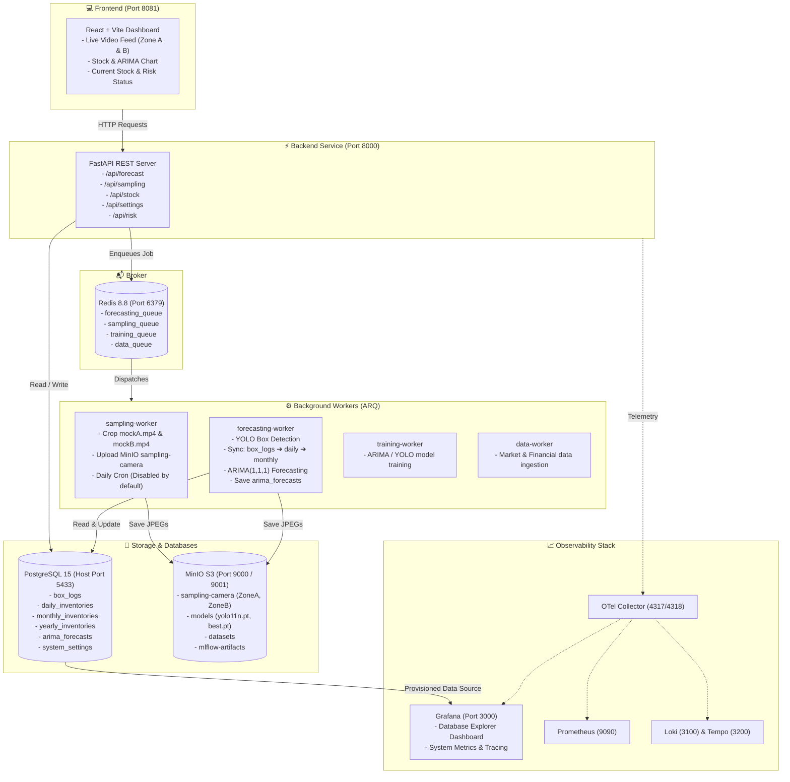

# ShrimpStock AI (I_LoveSeafood)

ระบบปัญญาประดิษฐ์และวิศวกรรมข้อมูล (AI Engineering Ecosystem) สำหรับบริหารจัดการสต็อกสินค้าอาหารทะเล (Frozen Shrimp) แบบอัตโนมัติครบวงจร ครอบคลุมตั้งแต่การดึงภาพจากกล้องวงจรปิดในคลัง, ตรวจนับกล่องด้วย YOLO, จัดเก็บข้อมูลลงฐานข้อมูลแบบลำดับชั้น (Daily / Monthly / Yearly), พยากรณ์ความต้องการสต็อกล่วงหน้าด้วย ARIMA และแสดงผล Dashboard แบบเรียลไทม์พร้อมระบบ Observability เต็มรูปแบบ

---

## 🏗️ สถาปัตยกรรมระบบ (System Architecture)



---

## 🔄 ลำดับการทำงานเมื่อกด Predict (Prediction Flow)

เมื่อผู้ใช้กดปุ่ม **"Run Prediction"** บนหน้า Dashboard:
1. **Trigger API**: Frontend ส่งคำขอ `POST /api/forecast` ไปยัง Backend
2. **Queueing**: Backend ส่งงานเข้าสู่ `forecasting_queue` บน Redis
3. **Frame Sampling & MinIO**: Worker ดึงเฟรมจากวิดีโอจำลองกล้อง `mockA.mp4` (Zone A - Cold Storage) และ `mockB.mp4` (Zone B - Processing), ครอปพื้นที่ ROI และอัปโหลดไฟล์ภาพ JPEG ไปยัง MinIO bucket `sampling-camera/ZoneA/` และ `ZoneB/`
4. **YOLO Detection**: โมเดล Ultralytics YOLO (`yolo11n.pt`) ทำการตรวจจับและนับจำนวนกล่องของแต่ละโซน (`boxes_a`, `boxes_b`, `total_boxes`)
5. **Database Hierarchical Sync**:
   - บันทึกประวัติการสุ่มตรวจลงตาราง **`box_logs`**
   - อัปเดตยอดสต็อกประจำวันลงตาราง **`daily_inventories`** สำหรับวันที่ปัจจุบัน (ป้องกันวันซ้ำด้วย UPSERT)
   - อัปเดตยอดสต็อกประจำเดือนลงตาราง **`monthly_inventories`** ประจำเดือนปัจจุบัน
6. **ARIMA Forecasting**: ดึงข้อมูลประวัติสต็อกรายเดือนย้อนหลังจาก `monthly_inventories` มาคำนวณโมเดล **ARIMA(1,1,1)** พยากรณ์ความต้องการสต็อก 3 เดือนล่วงหน้า
7. **Forecast Storage**: บันทึกค่าทำนายพร้อมช่วงความเชื่อมั่น (`lower_bound`, `upper_bound`) ลงตาราง **`arima_forecasts`**
8. **UI Live Refresh**: หน้า Dashboard โหลดข้อมูลใหม่ แสดงตัวเลขสต็อกปัจจุบันที่ตรวจจับได้จริง และอัปเดตเส้นกราฟพยากรณ์พร้อมประเมินสถานะความเสี่ยง (Risk Status) ทันที

---

## 🗄️ โครงสร้างฐานข้อมูลหลัก (Core Database Schema)

ฐานข้อมูล PostgreSQL ประกอบด้วย 4 ตารางหลักตามสถาปัตยกรรมใหม่:

| ตาราง (Table) | คอลัมน์สำคัญ | รายละเอียดหน้าที่ |
|---|---|---|
| **`box_logs`** | `time`, `product`, `boxes_a`, `boxes_b`, `total_boxes`, `camera_id`, `image_path`, `confidence` | บันทึก Log การตรวจนับกล่องจากกล้อง/YOLO แต่ละครั้ง และจัดเก็บ path รูปภาพบน MinIO |
| **`daily_inventories`** | `time` (Date), `product`, `boxes_a`, `boxes_b`, `total_boxes`, `inbound_boxes`, `outbound_boxes` | สรุปยอดสต็อกคงคลังรายวัน อัปเดตจากค่าตรวจจับล่าสุดของกล้อง (1 วันมี 1 Record ไม่ซ้ำ) |
| **`monthly_inventories`** | `time` (Date: YYYY-MM-01), `product`, `boxes_a`, `boxes_b`, `total_boxes` | ยอดสต็อกคงคลังรายเดือน โดยดึงค่าจาก **วันสิ้นเดือน** ของตารางรายวัน ใช้เป็น Time-series ป้อนเข้า ARIMA |
| **`yearly_inventories`** | `time` (Date: YYYY-01-01), `product`, `boxes_a`, `boxes_b`, `total_boxes` | ยอดสต็อกคงคลังรายปี โดยดึงค่าจาก **เดือน 12** ของแต่ละปี (2021 – 2025) |
| **`arima_forecasts`** | `time` (Date), `product`, `total_boxes`, `lower_bound`, `upper_bound`, `model_order` | ผลการทำนายปริมาณสต็อกในอนาคต 3 เดือนล่วงหน้า พร้อมค่า Lower/Upper Bound |
| **`system_settings`** | `key`, `value`, `description` | ค่าคอนฟิกของระบบ เช่น `risk_preference`, `low_stock_threshold`, `forecast_horizon` |

---

## 🚀 วิธีการ Clone และรันโปรเจกต์ให้สมบูรณ์ (Getting Started)

### 1. ข้อกำหนดเบื้องต้น (Prerequisites)
- [Git](https://git-scm.com/)
- [Docker Desktop](https://www.docker.com/products/docker-desktop/) (แนะนำ RAM อย่างน้อย 4 GB - 6 GB ขึ้นไป)

### 2. ขั้นตอนการติดตั้งและเริ่มระบบ (Setup & Run)

#### ขั้นตอนที่ 1: Clone Repository
```bash
git clone <repository-url>
cd I_LoveSeafood
```

#### ขั้นตอนที่ 2: เตรียมไฟล์ Environment Variables
```bash
# บน Windows (PowerShell):
copy .env.example .env

# บน Linux / macOS:
cp .env.example .env
```

#### ขั้นตอนที่ 3: สั่งรัน Container ทั้งหมดด้วย Docker Compose
```bash
docker compose up -d --build
```
> ระบบจะทำการ:
> 1. สตาร์ท PostgreSQL 15, Redis 8.8, MinIO
> 2. สตาร์ท `minio-init` เพื่อสร้าง Bucket เริ่มต้นให้อัตโนมัติ (`sampling-camera`, `models`, `datasets`, `mlflow-artifacts`, `ai-ecosystem-data`)
> 3. สตาร์ท Backend, Background Workers, Observability Services และ Frontend (Vite)

#### ขั้นตอนที่ 4: เตรียมข้อมูลและ Seed ฐานข้อมูลให้สมบูรณ์ (Database Initialization)
รันสคริปต์เพื่อสร้าง/อัปเดตข้อมูลย้อนหลัง 6 ปี (2021 ถึง 4 ต.ค. 2026 เวลา 23:00 น.) เข้าสู่ 4 ตารางหลัก:
```bash
# รันผ่าน Backend Container โดยตรง:
docker compose exec backend python /workers/adjust_database_data.py
```
*คำสั่งนี้จะทำการนำเข้าข้อมูล `daily_inventories` จากไฟล์ CSV, ซิงค์ยอดสิ้นเดือนเข้า `monthly_inventories`, ยอดเดือน 12 เข้า `yearly_inventories` และเตรียมค่าใน `box_logs` ให้พร้อมทำงานทันที*

#### ขั้นตอนที่ 5: ตรวจสอบความพร้อมของระบบ (Health Check)
```bash
# ตรวจสอบสถานะการเชื่อมต่อ Database, Redis, MinIO:
curl http://localhost:8000/health
```
ผลลัพธ์ต้องแสดง `"status": "healthy"` และทุกบริการเป็น `"connected"`

---

## 🌐 พอร์ตและการเข้าใช้งานบริการ (Service Endpoints)

| บริการ (Service) | URL | ข้อมูลการเข้าใช้งาน (Credentials) | รายละเอียด |
|---|---|---|---|
| **Frontend Dashboard** | [http://localhost:8081](http://localhost:8081) | ไม่ต้องล็อกอิน | หน้าหลักแสดงสต็อก, วิดีโอกล้องสด, กราฟ และปุ่ม Run Prediction |
| **Backend API (Swagger)** | [http://localhost:8000/docs](http://localhost:8000/docs) | ไม่ต้องล็อกอิน | เอกสาร API และเครื่องมือทดสอบ Interactive OpenAPI |
| **MinIO Web Console** | [http://localhost:9001](http://localhost:9001) | User: `admin`<br>Password: `password123` | จัดการ Bucket, ตรวจดูภาพที่แคปจากกล้องใน `sampling-camera` |
| **MinIO S3 API** | `http://localhost:9000` | Access Key: `admin`<br>Secret: `password123` | S3 API สำหรับ Workers และ Backend |
| **Grafana Dashboards** | [http://localhost:3000](http://localhost:3000) | Anonymous Access (ไม่ต้องล็อกอิน) | แดชบอร์ด **Database Explorer** ดูข้อมูล 4 ตารางสดจาก Postgres |
| **MLflow Tracking** | [http://localhost:5000](http://localhost:5000) | ไม่ต้องล็อกอิน | ตรวจสอบโมเดลพยากรณ์และ Experiment Artifacts |
| **Prometheus Metrics** | [http://localhost:9090](http://localhost:9090) | ไม่ต้องล็อกอิน | ตรวจสอบ Metrics ของระบบ |
| **PostgreSQL** | `localhost:5433` (พอร์ต Host) | User: `admin`<br>Password: `secretpassword`<br>DB: `my_database` | เข้าถึงผ่าน DBeaver, DataGrip หรือ `psql` |
| **Redis** | `localhost:6379` | ไม่มีรหัสผ่าน | Broker คิวงานของ ARQ Workers |

---

## 📡 สรุป API Endpoints สำคัญ

| Method | Endpoint | รายละเอียดหน้าที่ |
|---|---|---|
| `GET` | `/health` | ตรวจสอบสถานะการเชื่อมต่อ PostgreSQL, Redis และ MinIO |
| `POST` | `/api/forecast` | จัดคิวเริ่มงานพยากรณ์ (จะรัน Sampling + YOLO + Sync DB + ARIMA ให้อัตโนมัติ) |
| `GET` | `/api/forecast/{job_id}` | ตรวจสอบสถานะและผลลัพธ์ของ Job พยากรณ์ |
| `GET` | `/api/forecast/latest?product=...` | ดึงผลการพยากรณ์ ARIMA ล่าสุดจากตาราง `arima_forecasts` |
| `POST` | `/api/sampling/capture` | สั่งแคปภาพจากกล้อง, รัน YOLO และบันทึกเข้า MinIO / DB ทันทีแบบ Manual |
| `GET` | `/api/sampling/status` | ดูสถานะ Bucket `sampling-camera` และสถานะ Daily Schedule |
| `GET` | `/api/sampling/logs` | ดึงรายการล่าสุดจากตาราง `box_logs` |
| `GET` | `/api/stock/summary` | ดูภาพรวมปริมาณสต็อกปัจจุบัน ยอดเฉลี่ย ต่ำสุด สูงสุด |
| `GET` | `/api/stock/history?product=...` | ดึงข้อมูลประวัติสต็อกรายเดือนจาก `monthly_inventories` ไปแสดงกราฟ |
| `GET` | `/api/settings` / `PUT /api/settings` | อ่านและแก้ไขการตั้งค่าระบบ (`risk_preference`, `low_stock_threshold`) |
| `POST` | `/api/risk/evaluate` | ประเมินความเสี่ยงสต็อกขาด/ล้นตามเกณฑ์ Threshold ที่กำหนด |

---

## 🛠️ คำสั่งการจัดการระบบ (Useful Commands)

```bash
# ดู Log การทำงานของ Backend, Workers และ Frontend พร้อมกัน
docker compose logs -f backend forecasting-worker sampling-worker

# ดู Log เฉพาะตอนกดรัน Predict
docker compose logs -f forecasting-worker

# สั่งรัน Daily Sampling Manual ผ่าน CLI
docker compose exec sampling-worker python -c "import asyncio; from sampling_worker.sampler import sample_camera_frames; asyncio.run(sample_camera_frames())"

# หยุดระบบชั่วคราว (รักษาข้อมูลใน Database และ MinIO ไว้)
docker compose stop

# ปิดระบบทั้งหมด
docker compose down

# ล้างระบบและลบ Named Volumes ทั้งหมด (เริ่มต้นใหม่จากศูนย์)
docker compose down -v
```
